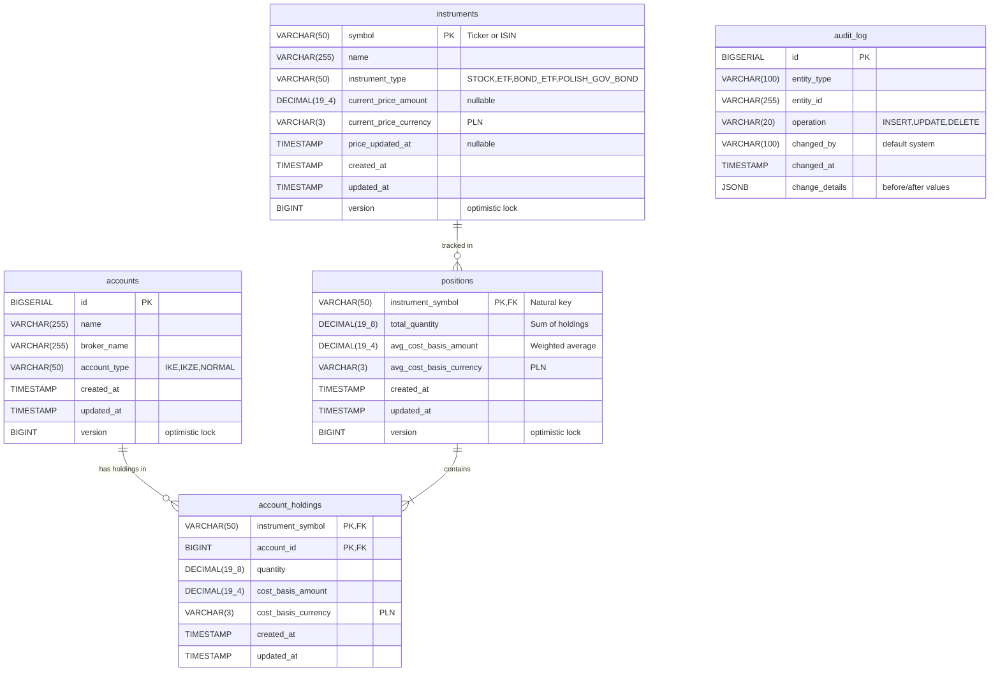

# Database Schema Diagram

PostgreSQL database schema for Investment Tracker application.



## Relationships

**accounts ➜ account_holdings**: One-to-Many
- One account can have multiple holdings
- Foreign key: `account_holdings.account_id → accounts.id`
- Cascade: `ON DELETE RESTRICT` (cannot delete account with holdings)

**instruments ➜ positions**: One-to-Many
- One instrument can have one position (1:1 in practice, but FK is 1:N)
- Foreign key: `positions.instrument_symbol → instruments.symbol`
- Cascade: `ON DELETE RESTRICT` (cannot delete instrument if positions exist)

**positions ➜ account_holdings**: One-to-Many (Aggregate Composition)
- One position contains multiple account holdings
- Foreign key: `account_holdings.instrument_symbol → positions.instrument_symbol`
- Cascade: `ON DELETE CASCADE` (deleting position deletes all holdings)

## Key Design Points

### Natural Keys
- **Position**: `instrument_symbol` (natural key aligns with domain language)
- **Instrument**: `symbol` (ticker or ISIN)

### Surrogate Keys
- **Account**: `id` (BIGSERIAL auto-increment)

### Composite Keys
- **AccountHolding**: `(instrument_symbol, account_id)` uniquely identifies holding

### Money Precision
- **Money amounts**: `DECIMAL(19, 4)` - 4 decimals for calculation precision
- **Quantities**: `DECIMAL(19, 8)` - 8 decimals for fractional shares

### Cascade Strategy
```
DELETE Position → CASCADE → Delete AccountHoldings (aggregate boundary)
DELETE Account → RESTRICT if Holdings exist (safety check)
DELETE Instrument → RESTRICT if Positions exist (safety check)
```

### Indexes

**Primary Keys** (automatic):
- accounts(id)
- instruments(symbol)
- positions(instrument_symbol)
- account_holdings(instrument_symbol, account_id)

**Foreign Key Performance**:
- account_holdings(account_id)
- account_holdings(instrument_symbol)

**Query Performance**:
- instruments(instrument_type)
- instruments(price_updated_at)
- positions(updated_at)
- audit_log(entity_type, entity_id)
- audit_log(changed_at DESC)
- audit_log USING GIN (change_details)

## Audit Trail

The `audit_log` table is not related to other tables via foreign keys (intentional design).

**Purpose**: Track all changes to entities with before/after state in JSONB

**Example audit record**:
```json
{
  "entity_type": "Position",
  "entity_id": "AAPL",
  "operation": "UPDATE",
  "changed_by": "system",
  "changed_at": "2026-01-04T14:30:00",
  "change_details": {
    "before": {
      "total_quantity": "100.00000000",
      "avg_cost_basis_amount": "500.0000"
    },
    "after": {
      "total_quantity": "150.00000000",
      "avg_cost_basis_amount": "520.0000"
    },
    "reason": "Manual entry - added 50 shares at 560 PLN",
    "source": "ManualEntryService"
  }
}
```

---

**Related Documentation**:
- [ADR-005: Database Schema Design](../adr/ADR-005-database-schema.md)
- [ADR-006: Money Representation](../adr/ADR-006-money-representation.md)
- [Domain Model Diagram](domain-model.md)
