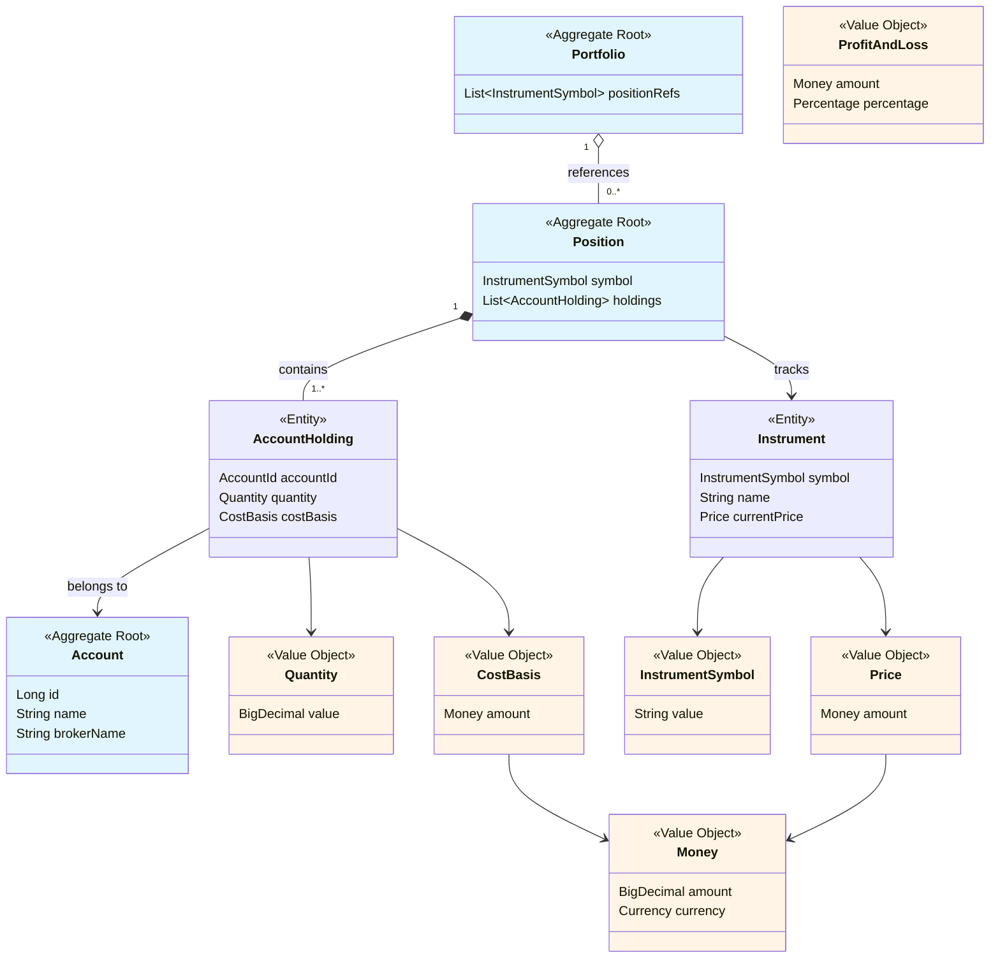

# Domain Model Diagram

Simple visual representation of the Investment Tracker domain model.

**Legend**:
- 🔵 Blue = Entities/Aggregate Roots
- 🟡 Yellow = Value Objects
- Solid line with filled diamond (`*--`) = Composition (owns)
- Solid line with empty diamond (`o--`) = Aggregation (references)
- Dashed arrow (`-->`) = Uses/depends on

**Key Points**:
- **Position** is aggregate root containing **AccountHoldings**
- **Portfolio** references positions by InstrumentSymbol
- **Account** is simple aggregate root
- **Instrument** is reference data (not an aggregate)
- All financial amounts use **Money** value object
- All value objects are immutable

---

**Related Documentation**:
- [ADR-001: Aggregate Boundaries](../adr/ADR-001-aggregate-boundaries.md)
- [ADR-002: Value Objects and Entities](../adr/ADR-002-value-objects-and-entities.md)
